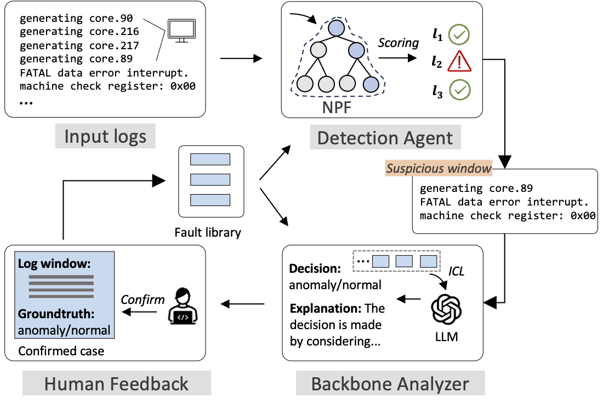

## Scalable and Adaptive Log-based Anomaly Detection: A Synergistic Approach

This is the anonymous repository for the ICDE'25  submission **# "Scalable and Adaptive Log-based Anomaly Detection: A Synergistic Approach"**. In this paper, we propose a practical log-based anomaly detection method **SeaLog**, aiming to be **accurate**, **lightweight** and **adaptive** to tackle challenges in real-world industral scenario.



### Industry Dataset Overview 

The industry dataset used in our paper is collected from a complicated service in CloudX (will be disclosed after paper review). The dataset consists of arond **100 types of failures** indicated by logs. For confidential reasons, we summarize these failures and their associated indicating logs for reference. One can find the details at [this link](/docs/industrial_dataset_overview.xlsx) 🔗.

In additon, we also open souce a small anonymized industral dataset for benefiting the community as follows. 

### Quick Start

- **Install requirements.**

  ```
  pip install -r requirements.txt
  ```
  
- **Execution.** 

  The following consists the complete pipeline of Sealog (i.e., using detection agent, using backbone analyzer and integrating feedback). One can adapt to your own data following the same format.

  For easy execution, we have provided a [cached results](/demo/scalead_result/Industry/llm_cache.json) from LLM to run the following code. If you would like to run with your own LLM options, please put your API BASE and API KEY at `common/gpt_api.py`.

  *Detection agent*

  ```
  python agent_demo.py --logname Industry --folder Industry
  ```

  *Backbone analyzer*

  ```
   python backbone_demo.py --logname Industry --folder Industry
  ```

  *Detecion agent (with feedback)*

  ```
  python agent_demo.py --logname Industry --folder Industry --llm_cache ./scalead_result/Industry/llm_cache.json
  ```

  Note that human feedback can also be utilized if given in the same format as in llm_cache.json. 

- **Public datasets**

  Download datasets from [this link](https://zenodo.org/records/10867025) 🔗, put the downloaded folders (BGL_ws=60m_s=60m_0.8train and Thunderbird_ws=60m_s=60m_0.8train) as follows.

  ```
  ├── demo
  ├── proceeded_data
  │   └── BGL
  │       └── BGL_ws=60m_s=60m_0.8train
  │          ├── test.pkl
  │          └── train.pkl
  │   └── Thunderbird
  │       └── Thunderbird_ws=60m_s=60m_0.8train
  │          ├── test.pkl
  │          └── train.pkl
  ```

### Repository Organization 

```
├── demo
│   ├── agent_demo.py # entry of the detection agent of SeaLog
│   └── backbone_demo.py # entry of the backbone analyzer of SeaLog
├── sealog
│   ├── agent.py # core code of the detection agnet
│   ├── backbone.py # core code of the backbone analyzer
│   ├── bayes_model.py # anomaly score calculation for the detection agent
│   ├── embedding_db.py # transforming logs to embedding vectors using OpenAI API
│   └── trie.py # tree structure & operations
├── common
│   ├── gpt_api.py # chatgpt API implementation
│   └── utils.py 
├── preprocess
│   ├── loader.py
│   └── preprocess_hpc.py # preprocessing scripts for BGL and thunderbird
├── proceeded_data # results of running preprocess_hpc.py 
├── requirements.txt
├── README.MD
```